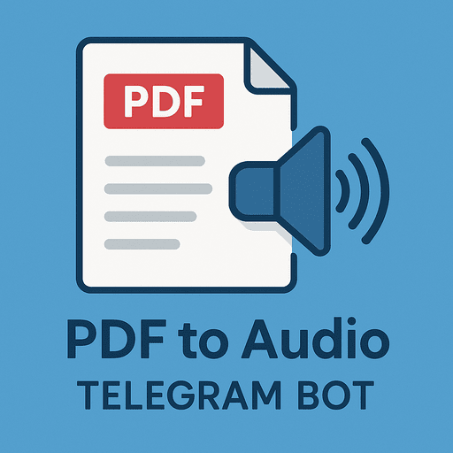

# PDF Audiobook Reader Bot

<div align="center">
  
  
  <p><em>A Telegram bot that converts PDF documents to audio files using Text-to-Speech technology.</em></p>
</div>

## Features

- 📄 Extract text from PDF files
- 🔊 Convert text to speech (MP3 audio)
- 🤖 Easy-to-use Telegram interface
- ⚡ Automatic processing and delivery

## Setup

### Prerequisites

- Python 3.8 or higher
- Telegram account
- Bot token from @BotFather

### Installation

1. Clone the repository:
```bash
git clone <your-repo-url>
cd myreader
```

2. Create a virtual environment:
```bash
python3 -m venv venv
source venv/bin/activate  # On Windows: venv\Scripts\activate
```

3. Install dependencies:
```bash
pip install -r requirements.txt
```

4. Configure environment variables:
```bash
cp .env.example .env
```

5. Edit `.env` and add your bot token:
```
BOT_TOKEN=your_actual_bot_token_from_botfather
```

### Getting a Bot Token

1. Open Telegram and search for `@BotFather`
2. Send `/newbot` and follow the instructions
3. Copy the token provided by BotFather
4. Paste it in your `.env` file

## Usage

### Running the Bot

```bash
python3 bot.py
```

### Using the Bot

1. Start a chat with your bot on Telegram
2. Send `/start` to see the welcome message
3. Send any PDF file to the bot
4. Wait for processing (may take a moment for large files)
5. Receive the audio file

## Deployment

### Heroku

The project includes `Procfile` and `runtime.txt` for Heroku deployment:

```bash
heroku create your-app-name
heroku config:set BOT_TOKEN=your_bot_token
git push heroku main
```

## Limitations

- Works best with text-based PDFs (not scanned images)
- Currently processes first ~4000 characters for large documents
- Requires stable internet connection for Telegram API

## Security

⚠️ **IMPORTANT**: Never commit your `.env` file or expose your bot token!

The `.gitignore` file is configured to exclude:
- `.env` files
- Virtual environments
- Python cache files
- Temporary files

## License

MIT License - Feel free to use and modify!

## Contributing

Pull requests are welcome! For major changes, please open an issue first.
